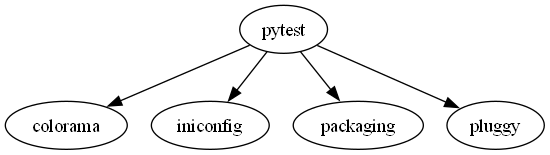

# **Dependency Visualizer**

## **Описание проекта**
Dependency Visualizer — это инструмент командной строки, предназначенный для визуализации графа зависимостей Python-пакетов. Скрипт анализирует указанный пакет, строит граф его зависимостей и сохраняет результат в виде изображения формата PNG.

---

## **Функциональность**
1. Построение графа зависимостей пакета, включая транзитивные зависимости.
2. Сохранение графа в формате `.dot` и его визуализация в формате `.png` с использованием Graphviz.

---

## **Установка и настройка**

### **Шаг 1: Клонирование репозитория**
```bash
git clone https://github.com/Wertais/DependencyVisualizer.git   
cd DependencyVisualizer
```

### **Шаг 2: Создание виртуального окружения**
```bash
python -m venv venv
venv\Scripts\activate  # Для Windows
```

### **Шаг 3: Установка зависимостей**
```bash
pip install -r requirements.txt
```

---

## **Использование**

### **Команда для запуска**
```bash
python main.py --package <имя_пакета> --output <путь_к_файлу>
```

### **Пример команды**
```bash
python main.py --package pytest --output example_output/dependency_graph.png
```

### **Пример результата**
После выполнения команды:
- В папке `example_output` создаётся файл `dependency_graph.png`.
- В консоли выводится следующий результат:

```plaintext
Путь для сохранения .dot файла: example_output/dependency_graph.dot
Путь для сохранения .png файла: example_output/dependency_graph.png
Содержимое .dot файла:
digraph G {
    "pytest" -> "colorama";
    "pytest" -> "iniconfig";
    "pytest" -> "packaging";
    "pytest" -> "pluggy";
}
.dot файл успешно создан: example_output/dependency_graph.dot
Выполнение команды Graphviz: dot -Tpng example_output/dependency_graph.dot -o example_output/dependency_graph.png
Граф зависимостей сохранён в example_output/dependency_graph.png
```

---

## **Пример результата**

Граф зависимостей для пакета `pytest`:


---

## **Тестирование**

Для запуска тестов выполните:
```bash
pytest
```

### **Пример результата тестов**
```plaintext
================================================= test session starts =================================================
platform win32 -- Python 3.12.6, pytest-8.3.4, pluggy-1.5.0
collected 1 item                                                                                                      

test.py .                                                                                                       [100%]

================================================== 1 passed in 0.01s ==================================================
```

---

## **Структура проекта**
```plaintext
DependencyVisualizer/
├── .github/
│   └── workflows/         # Настройки CI/CD 
├── config/                # Конфигурационные файлы
├── example_output/        # Пример результатов (графы зависимостей)
│   └── dependency_graph.png
├── tests/                 # Тесты
├── venv/                  # Виртуальное окружение
├── main.py                # Основной скрипт
├── test.py                # Файл с тестами
├── requirements.txt       # Зависимости проекта
├── README.md              # Документация
```

---

## **Дополнительная информация**
- Для визуализации графов используется Graphviz. Убедитесь, что Graphviz установлен и доступен в системной переменной `PATH`.
- Протестировано на Python 3.12.6.

**Дата выполнения:** *21.12.2024*

