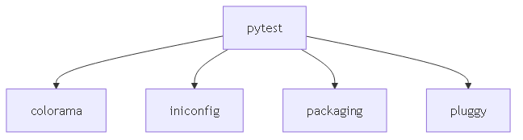

# **Dependency Visualizer**

## **Описание проекта**
Dependency Visualizer — это инструмент командной строки, предназначенный для визуализации графа зависимостей Python-пакетов. Скрипт анализирует указанный пакет, строит граф его зависимостей и сохраняет результат в виде изображения формата PNG.

---

## **Функциональность**
1. Построение графа зависимостей пакета, включая транзитивные зависимости.
2. Сохранение графа в формате `.mmd` и его визуализация в формате `.png` с использованием Mermaid CLI.

---

## **Описание функций и настроек**

### **Функции**

1. `get_dependencies(package_name)`
   - **Описание:** Получает список зависимостей для указанного пакета.
   - **Параметры:**
     - `package_name` (str): Имя пакета Python.
   - **Возвращает:** Список зависимостей (list).
   - **Пример использования:**
     ```python
     dependencies = get_dependencies("pytest")
     print(dependencies)  # ['pluggy', 'colorama', ...]
     ```

2. `build_graph(package_name, output_path)`
   - **Описание:** Создаёт граф зависимостей в формате `.mmd` и преобразует его в изображение `.png`.
   - **Параметры:**
     - `package_name` (str): Имя пакета Python.
     - `output_path` (str): Путь для сохранения `.png` файла.
   - **Пример использования:**
     ```python
     build_graph("pytest", "example_output/dependency_graph.png")
     ```

3. `main()`
   - **Описание:** Главная функция для обработки аргументов командной строки и вызова `build_graph`.
   - **Параметры командной строки:**
     - `--package` (str): Имя анализируемого пакета.
     - `--output` (str): Путь к файлу изображения (.png).
   - **Пример запуска:**
     ```bash
     python -m dependency_visualizer.main --package pytest --output example_output/dependency_graph.png
     ```

---

## **Установка и настройка**

### **Шаг 1: Клонирование репозитория**
```bash
git clone https://github.com/Wertais/DependencyVisualizer.git
cd DependencyVisualizer
```

### **Шаг 2: Создание виртуального окружения**
```bash
python -m venv venv
venv\Scripts\activate  # Для Windows
```

### **Шаг 3: Установка зависимостей**
```bash
pip install -r requirements.txt
```

### **Шаг 4: Установка Mermaid CLI**
Убедитесь, что Node.js установлен, затем выполните:
```bash
npm install -g @mermaid-js/mermaid-cli
```

---

## **Использование**

### **Команда для запуска**
```bash
python -m dependency_visualizer.main --package <имя_пакета> --output <путь_к_файлу>
```

### **Пример команды**
```bash
python -m dependency_visualizer.main --package pytest --output example_output/dependency_graph.png
```

### **Пример результата**
После выполнения команды:
- В папке `example_output` создаётся файл `dependency_graph.png`.
- Также создаётся промежуточный `.mmd` файл для Mermaid CLI.
- В консоли выводится следующий результат:

```plaintext
Путь для сохранения .mmd файла: example_output/dependency_graph.mmd
Путь для сохранения .png файла: example_output/dependency_graph.png
Содержимое .mmd файла:
graph TD
    pytest --> colorama
    pytest --> iniconfig
    pytest --> packaging
    pytest --> pluggy
.mmd файл успешно создан: example_output/dependency_graph.mmd
Выполнение команды Mermaid CLI: mmdc -i example_output/dependency_graph.mmd -o example_output/dependency_graph.png
Граф зависимостей сохранён в example_output/dependency_graph.png
```

---

## **Пример результата**

Граф зависимостей для пакета `pytest`:


---

## **Тестирование**

Для запуска тестов выполните:
```bash
pytest
```

### **Пример результата тестов**
```plaintext
================================================= test session starts =================================================
platform win32 -- Python 3.12.6, pytest-8.3.4, pluggy-1.5.0
collected 1 item                                                                                                      

test.py .                                                                                                      [100%]

================================================== 1 passed in 0.01s ==================================================
```

---

## **Скрипт сборки**

Для автоматической сборки проекта можно использовать следующий файл `setup.py`:

```python
from setuptools import setup, find_packages

setup(
    name="DependencyVisualizer",
    version="1.0.0",
    packages=find_packages(),
    install_requires=[
        "graphviz",
        "pytest",
    ],
    entry_points={
        'console_scripts': [
            'dependency-visualizer=dependency_visualizer.main:main',
        ],
    },
)
```

### Установка через setup.py

```bash
pip install .
```

После установки можно использовать команду:
```bash
dependency-visualizer --package pytest --output example_output/dependency_graph.png
```

---

## **Структура проекта**
```plaintext
DependencyVisualizer/
├── .github/
│   └── workflows/         # Настройки CI/CD
├── dependency_visualizer/
│   ├── __init__.py
│   ├── main.py
├── example_output/        # Пример результатов (графы зависимостей)
│   ├── dependency_graph.mmd
│   └── dependency_graph.png
├── tests/                 # Тесты
├── venv/                  # Виртуальное окружение
├── main.py                # Основной скрипт
├── test.py                # Файл с тестами
├── requirements.txt       # Зависимости проекта
├── README.md              # Документация
├── setup.py               # Скрипт для сборки
```

---

## **Дополнительная информация**
- Для визуализации графов используется Mermaid CLI. Убедитесь, что Mermaid CLI установлен и доступен в PATH.
- Протестировано на Python 3.12.6.

---

**Дата выполнения:** *21.12.2024*

